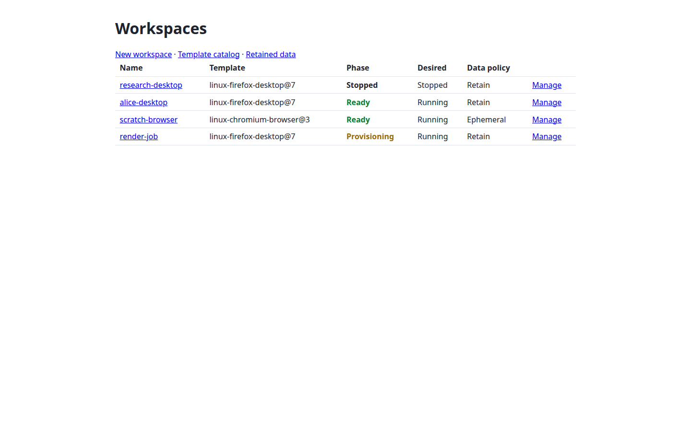
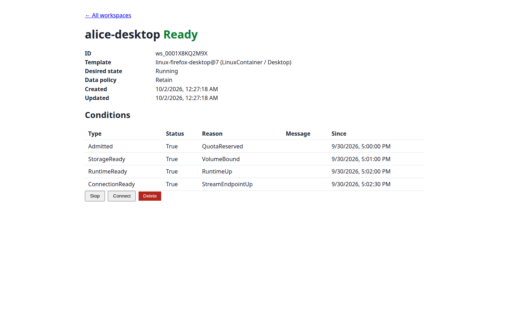
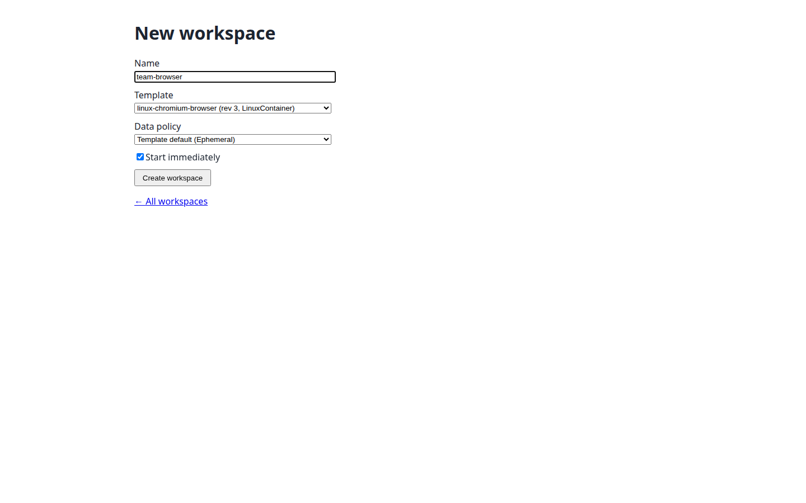
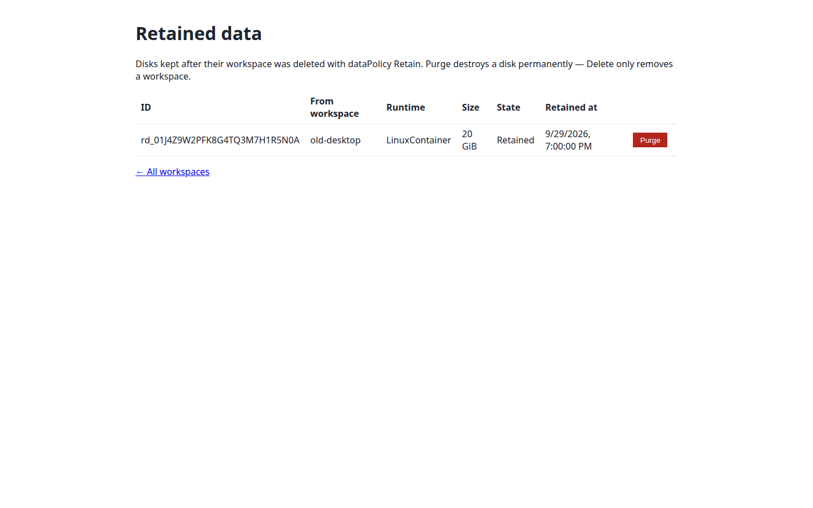
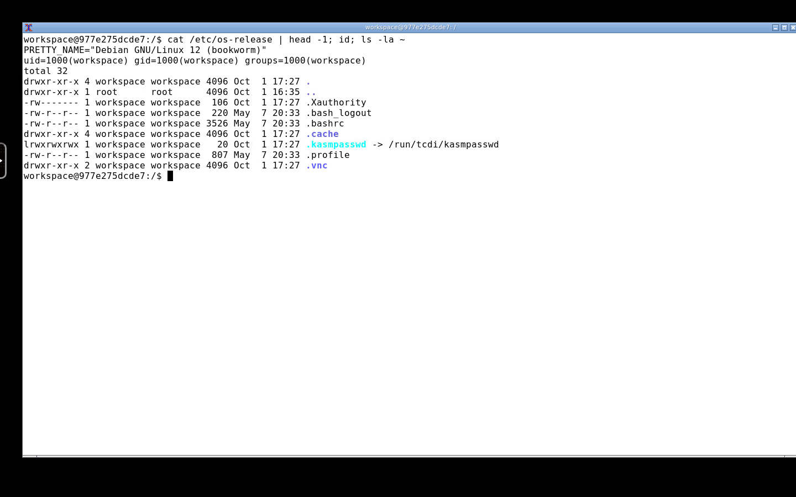
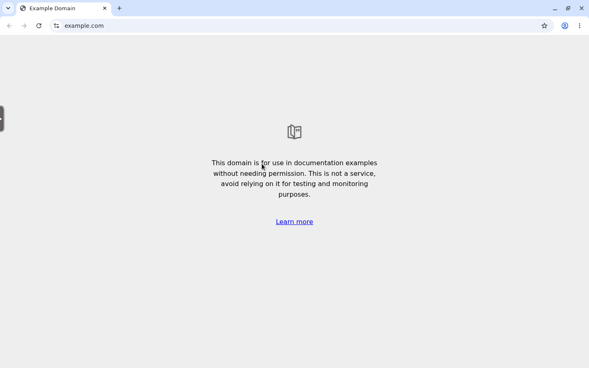

# TinyCDI

[](https://github.com/tinyorbitvn/tinycdi/actions/workflows/ci.yml)
[](https://github.com/tinyorbitvn/tinycdi/releases)
[](LICENSE)

TinyCDI is a self-hosted platform that gives users disposable Linux desktop
and browser workspaces on Kubernetes — streamed straight into their browser
over KasmVNC. It exists for teams that want Kasm-style remote desktops
without the Kasm Workspaces control plane: a small Go backend (API,
session gateway and broker in one binary), an operator that reconciles
`Workspace` CRDs into locked-down pods, and a React portal on top. The Windows desktop track (KubeVirt +
Guacamole/RDP) is deferred pending its own proof gate.

## Architecture

The control plane runs four Deployments: the **portal** (SPA plus a `/v1`
proxy to the API), the **API** (public REST surface plus the session
broker's internal mTLS listener), the session **gateway** (a separate
public host that redeems launch tickets and reverse-proxies the runtime)
and the **operator** (`Workspace`/`WorkspaceTemplate` CRDs). The v0.2
target — [ADR 0005](docs/adr/0005-backend-frontend-operator.md)
(proposed) — consolidates these into three: a merged **backend** (API +
session gateway + in-process broker on four listeners), a static
**frontend** and the operator, behind one visible URL, with each
workspace served on its own `<label>.<sessionDomain>` host so parallel
sessions stay isolated. Details: [docs/architecture.md](docs/architecture.md).

## Features

- **Desktop & browser workspaces in the browser** — Linux desktop and
  ephemeral Chromium/Firefox sessions streamed over KasmVNC WebSocket
  (HTTPS, no client install).
- **OIDC SSO with a group gate** — users authenticate through your
  identity provider; only allowed groups get in.
- **One-use launch tickets + hardened session gateway** — opaque,
  TTL-bound, single-use tickets redeem at a separate session origin that
  enforces launch-origin policy and reverse-proxies to the runtime.
- **Kubernetes operator** — `workspaces.cdi.tinyorbit.vn` CRDs
  (`Workspace`, `WorkspaceTemplate`) reconcile pods, PVCs and lifecycle.
- **Isolation by default** — per-workspace NetworkPolicy/egress profiles,
  Localhost seccomp + AppArmor node profiles, non-root runtime with all
  capabilities dropped, and Chromium's sandbox kept *on*.
- **Persistent / retained home data** — Retain or Ephemeral data policy
  per workspace; retained disks can be re-attached or purged.
- **Per-tenant quotas**, workspace lifecycle controls and idempotent API.
- **Helm chart** — one-command install/upgrade, CRDs, RBAC and
  NetworkPolicy baseline included.
- **Signed releases** — images on `ghcr.io` with SBOMs, SLSA provenance
  and signature verification (see `docs/security/provenance.md`).

## Screenshots

| Workspace portal | Live session |
|---|---|
|  |  |
|  |  |
|  |  |

Screenshots are real captures of the shipped images and portal —
regenerate them with `node web/scripts/screenshots.mjs`
(see `docs/development.md`).

## Quick start

Requires a Kubernetes cluster (≥ 1.30) with NetworkPolicy enforcement, a
PostgreSQL database, an OIDC provider and a StorageClass for retained
data. Install the published chart:

```sh
helm install tinycdi oci://ghcr.io/tinyorbitvn/charts/tinycdi \
  -n tinycdi-system --create-namespace -f my-values.yaml
```

Start from `deploy/helm/tinycdi/ci/example-values.yaml`, then follow the
full procedure — secrets, TLS, node profiles — in
[`docs/runbooks/install.md`](docs/runbooks/install.md). Chart reference:
[`deploy/helm/tinycdi/README.md`](deploy/helm/tinycdi/README.md).
Unmodified `kasmweb/*` workspace images can also run through the injected
adapter (`spec.linux.adapter: kasm`) — see [`docs/kasm-images.md`](docs/kasm-images.md).

## Documentation

- [Documentation index](docs/README.md)
- [Architecture](docs/architecture.md) — design doc + ADRs
- [Runtime image contract](docs/images.md) · [Compatibility pins](docs/compatibility.md)
- [Runbooks](docs/runbooks/install.md) — install, upgrade, retained data, DR, capacity
- [Development](docs/development.md) — repo layout, build, test, screenshots

## Security

TinyCDI runs other people's desktops — vulnerability reports go through
GitHub private reporting, and hardening rules are mandatory for
contributors and operators. See [`SECURITY.md`](SECURITY.md).

## License

MIT — see [`LICENSE`](LICENSE). Third-party notices: [`NOTICE`](NOTICE),
[`THIRD_PARTY_LICENSES.md`](THIRD_PARTY_LICENSES.md). The runtime images
redistribute KasmVNC under GPL-2.0 — the corresponding-source offer is in
[`SOURCE-OFFER`](SOURCE-OFFER).

TinyCDI is an independent project, not affiliated with or endorsed by
Kasm Technologies, Google or the Mozilla Foundation. "KasmVNC"/"Kasm",
"Chromium"/"Chrome" and "Firefox" are trademarks of their respective
owners, used only to identify third-party components.
