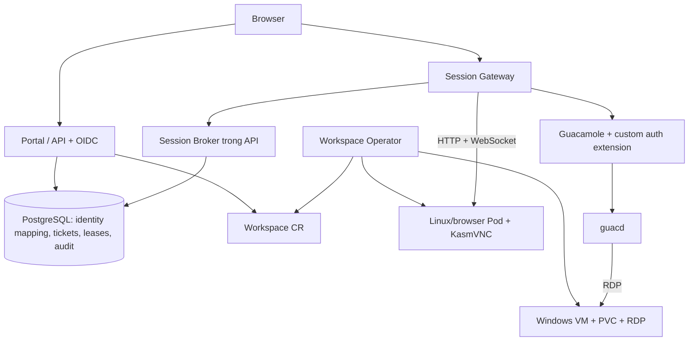

# Thiết kế nền tảng workspace trên Kubernetes
> **English note:** this document is in Vietnamese — it is the original design/ADR kept for reference. Current platform state is described by `README.md`, `docs/images.md`, `docs/compatibility.md` and `docs/runbooks/`.
>
> **v0.2 target architecture:** [ADR 0005](adr/0005-backend-frontend-operator.md)
> (proposed) supersedes the component split below — three Deployments
> (`backend`, `frontend`, `operator`), one visible URL, and every
> workspace session on its own `<label>.<sessionDomain>` host with
> restart-safe sessions. The component list under "Current components"
> describes v0.1 and is kept until the v0.2 gates land.

## Current components (English summary)

- **Portal** (`web/` + `build/portal`): React SPA served with the API on one
  origin; session launches open the gateway origin.
- **API** (`cmd/api`, `internal/api`): public REST surface (`/v1`),
  identity/OIDC, quotas, workspace CRUD, retained-data inventory.
- **Broker** (`internal/broker`): connection tickets (opaque, single-use,
  TTL-bound), leases, revocation, activity.
- **Gateway** (`cmd/gateway`, `internal/gateway`): session edge — ticket
  redemption, launch-origin policy, authenticated reverse proxy to the
  runtime's streaming endpoint.
- **Operator** (`cmd/operator`, `internal/operator`): reconciles `Workspace`
  / `WorkspaceTemplate` CRDs (`api/`), provisions runtime pods, enforces
  per-workspace NetworkPolicy, runs the teardown finalizer.
- **Runtime images** (`build/linux-desktop`, `build/browser`): non-root
  KasmVNC desktop on Debian bookworm, HTTPS endpoint on :8443, credentials
  via mounted secrets.

Design decisions live in the ADRs under `docs/adr/`; pinned
dependency/toolchain versions are in `docs/compatibility.md`. Build, test
and repo-layout documentation is in `docs/development.md`.

---

Ngày: 2026-09-29. Trạng thái: đã triển khai cho Linux MVP — đây là tài liệu thiết kế gốc, giữ để tham chiếu; trạng thái hiện tại xem README.md, docs/images.md và docs/compatibility.md.

## 1. Mục tiêu và giả định

Yêu cầu đã có: custom project dựa trên KasmVNC; hỗ trợ OS/browser và Windows; operator chạy trên Kubernetes; vượt 5 session đồng thời, không phụ thuộc Kasm Workspaces CE.

Giả định dùng để lập kế hoạch, có thể điều chỉnh:

- OS = Linux desktop; browser = Chrome/Chromium hoặc Firefox trong Linux container; Windows = Windows desktop VM có RDP. macOS không nằm trong phạm vi.
- Một cluster Kubernetes do user chọn (kiểm chứng trên RKE2), Linux amd64 worker; CNI thực thi NetworkPolicy; DNS/TLS và StorageClass cung cấp PVC sẵn có. KubeVirt + CDI và CSI clone/snapshot đã kiểm chứng là prerequisite của đường Windows/retained disk — hiện deferred, không phải điều kiện đường Linux.
- Nội bộ tổ chức, user đăng nhập qua OIDC. Không quảng bá namespace/container là ranh giới an toàn cho khách hàng thù địch nhau.
- Mục tiêu nghiệm thu ban đầu: 25 workspace đồng thời gồm 20 Linux/browser + 5 Windows, sau đó đo ở 50. Đây là workload kiểm thử, không phải trần license hoặc cam kết công suất.
- Mặc định đề xuất: browser ephemeral; Linux desktop giữ home PVC; Windows giữ boot disk riêng. Một user có thể có nhiều workspace theo quota, nhưng một workspace chỉ có một kết nối tương tác được cấp quyền tại một thời điểm.
- Không lấy bất kỳ service/API/UI độc quyền nào của Kasm Workspaces làm dependency.

## 2. Lựa chọn kiến trúc

| Cách làm | Đánh đổi | Quyết định |
|---|---|---|
| Linux/browser Pod + KasmVNC; Windows KubeVirt + RDP | Hai đường streaming, dùng tài nguyên phù hợp mỗi workload | Chọn cho MVP |
| Mọi desktop là KubeVirt VM | Kernel riêng cho từng workspace, tốn RAM/disk và khởi động chậm hơn | Thêm LinuxVM khi cần isolation mạnh hơn |
| Port KasmVNC thành Windows server | Phải duy trì thêm display/input/encoding stack trên Windows | Không chọn |

KasmVNC được định hướng Linux và có protocol khác VNC/RFB truyền thống. Dùng web client KasmVNC cho Linux; không giả định guacd VNC kết nối được KasmVNC. Windows dùng Guacamole + guacd + RDP. [Nguồn KasmVNC](https://github.com/kasmtech/KasmVNC), [Guacamole architecture](https://guacamole.apache.org/doc/gug/guacamole-architecture.html).

## 3. Thành phần

- **Portal:** React/TypeScript; catalog template, create/start/stop/delete, trạng thái, mở desktop, lỗi có hướng xử lý. Desktop mở tab riêng trên session origin.
- **API + Session Broker:** Go, OpenAPI; OIDC, tenant membership, ownership, quota reservations, idempotency, connection tickets và access leases. MVP chung binary, module riêng.
- **Operator:** Go + Kubebuilder/controller-runtime; chỉ reconcile Kubernetes resources và runtime lifecycle. Không nhận traffic desktop, không chứa OIDC login flow.
- **Session Gateway:** Go reverse proxy cho HTTP/WebSocket; xác thực mọi route desktop, kiểm tra Origin, host và lease; không nhận upstream URL tùy ý từ client.
- **Windows adapter:** dùng Guacamole webapp/client upstream cùng custom authentication extension Java. Extension lấy connection đã cấp quyền từ Broker qua mTLS; guacd hoàn toàn internal. Không viết lại RDP hoặc Guacamole tunnel protocol.
- **PostgreSQL:** state giao dịch của user API, reservation, ticket, lease và audit. Không phải nguồn desired state của Pod/VM. Connection từ api bắt buộc TLS có verify (`sslmode=verify-ca`/`verify-full`; xem mục 6.1) — chart render `PGSSLMODE`/`PGSSLROOTCERT` từ `database.tls`.
- **Kubernetes API:** nguồn desired/observed state của workspace. Secret chứa credential runtime; status CR không chứa password/token.
- **Helm:** chart của project; không tự cài/upgrade KubeVirt, CDI hoặc storage cluster. Kiểm tra prerequisites trước.

Không đưa Redis, service mesh hay message bus vào MVP. PostgreSQL đủ cho việc claim ticket và connection lease ở quy mô nghiệm thu; benchmark rồi mới bổ sung thành phần.

## 4. API resources và ownership

API group: `workspaces.cdi.tinyorbit.vn/v1alpha1`.

**WorkspaceTemplate** — namespaced, chỉ admin được publish. Revision bất biến, chứa:

- `runtime: LinuxContainer | WindowsVM` và `experience: Desktop | Browser`.
- Linux: OCI image theo digest; command và browser restrictions do admin đặt.
- Windows: source PVC đã seal, phiên bản template và metadata checksum; source cùng namespace tenant cho MVP, CSI snapshot/clone đã kiểm thử.
- CPU/memory/storage profile, thời hạn boot, permitted network profile, clipboard policy.
- Lifecycle defaults: idle/disconnect timeout, max running duration, dữ liệu giữ/xóa.
- Không cho end user nhập raw PodSpec, hostPath, privileged, container command hoặc arbitrary VM manifest.

**Workspace** — namespaced, spec do API/operator service accounts quản lý:

- `templateRef`, `ownerSubject` (OIDC issuer + sub bất biến), `desiredState: Running | Stopped`.
- `dataPolicy: Ephemeral | Retain`, resources profile lấy từ template; không tự truyền password.
- `runtimeGeneration`: số đơn điệu theo workspaceUID do API cấp khi chấp nhận intent đưa runtime sang Running (create với `desiredState: Running` hoặc start từ Stopped), ghi vào spec trong cùng outbox intent; Stop/Delete fence generation hiện tại và start sau đó cấp generation mới.
- `runtimeUID`: Pod/VMI UID của incarnation hiện tại thuộc `observedRuntimeGeneration`, do operator quan sát và báo qua status. Một generation gồm một hoặc nhiều incarnation — operator thay Pod/VMI sau crash/reschedule tạo incarnation mới với `runtimeUID` mới. Ticket, lease, activity và fencing ràng cả ba (workspaceUID, runtimeGeneration, runtimeUID); generation cũ hoặc runtimeUID không còn là incarnation hiện tại đều bị từ chối, nên runtime thay mới tự động vô hiệu truy cập cũ và user reconnect bằng ticket mới.
- `intentRevision`: số thứ tự đơn điệu serialize mọi intent vòng đời của cùng một workspace (create/start/stop/delete/attach/purge), do API tăng trong transaction với record workspace. Ba số này độc lập: `intentRevision` fence thứ tự intent, `runtimeGeneration` fence identity của giai đoạn Running, `runtimeUID` fence identity của incarnation cụ thể trong generation đó.
- Status: `observedGeneration`, `observedRuntimeGeneration`, `runtimeUID`, `lastAppliedIntentRevision`, `phase`, `conditions`, internal service reference, data references, timestamps. Operator bỏ qua spec có `intentRevision` thấp hơn `lastAppliedIntentRevision`.
- Phase: `Pending`, `Provisioning`, `Ready`, `Stopping`, `Stopped`, `Failed`, `Terminating`.
- Conditions gồm `Admitted`, `StorageReady`, `RuntimeReady`, `ConnectionReady`, `Degraded`; phase là tóm tắt, conditions/reasons mới là căn cứ vận hành.
- TemplateRef/owner/runtime/dataPolicy immutable sau create; đổi image bằng quy trình workspace replacement, không rolling update desktop đang dùng.

**WorkspacePool** cho warm capacity và **TenantPolicy** dạng CRD chưa cần trong MVP. MVP lưu tenant policy/quota tại Broker, namespace ResourceQuota làm lớp giới hạn runtime thứ hai.

Kubernetes chỉ Broker/operator/admin có quyền ghi Workspace. Không cho end user có kubeconfig rồi bypass admission. CRD schema/webhook xác nhận invariants ngay cả khi admin dùng kubectl; controller từ chối workload không hợp lệ.

## 5. Vòng đời và bảo toàn dữ liệu

| Thao tác | Linux/browser | Windows | Dữ liệu |
|---|---|---|---|
| Disconnect | Đóng stream | Ngắt RDP transport | Giữ runtime, bắt đầu grace timer |
| Stop | Terminate Pod | Shutdown VM, chờ VMI kết thúc | Ephemeral xóa scratch; Retain giữ PVC |
| Start | Pod mới, mount lại home | Boot VM từ disk cũ | Giữ dữ liệu persistent; không giữ RAM/process |
| Delete | Thu hồi truy cập, xóa runtime/service/secret | Thu hồi truy cập, xóa VM và ephemeral child objects | Retain chuyển disk sang retained inventory; Ephemeral xóa disk |
| Attach disk retained | Mount PVC retained vào workspace mới | Boot VM mới từ disk retained rồi re-enroll | Claim độc quyền disk trong retained inventory; workspace mới, identity mới |
| Purge data | Admin/user owner yêu cầu riêng với confirmation trong UI | Tương tự | Xóa disk đã retain sau kiểm tra không còn attach |

Linux persistent chỉ bảo toàn thư mục home/data đã mount. Gói phần mềm cài vào root filesystem container không tự tồn tại sau Stop. Windows giữ full disk nhưng Stop không phải hibernate.

Persistent PVC không có ownerReference dẫn đến GC khi Workspace/VM/DataVolume bị xóa. Với Windows, clone trước thành DataVolume/PVC độc lập rồi attach bằng PVC reference; không để VM-owned dataVolumeTemplates nắm disk cần retain. Phải kiểm thử cả quan hệ ownership DataVolume → PVC của phiên bản CDI được chọn. Retained disk lưu owner/tenant/workspaceUID metadata, quota storage tiếp tục tính đến lúc purge. Phục hồi từ disk retained là API riêng (`POST /v1/data/{id}/attach` hoặc create workspace kèm `retainedDataRef`), chỉ owner trong record retained hoặc tenant admin được gọi. Record retained có máy trạng thái `Retained → Attaching → Attached` và `Retained → Purging → Purged`; mỗi chuyển trạng thái là conditional update trong cùng transaction với quota reservation và outbox intent, nên attach và purge loại trừ nhau và một disk có tối đa một consumer tại một thời điểm. Khi attach thành công, disk trở thành disk của workspace mới (workspaceUID mới) thay vì clone thêm bản sao; nếu attach thất bại hoặc workspace mới bị xóa trước khi attach hoàn tất, disk quay về `Retained`, không mất theo ownerReference. Workspace tạo từ attach là runtime identity mới: nhận `runtimeGeneration` và enrollment token mới, credential runtime cũ của workspace đã xóa bị vô hiệu qua re-enrollment ở lần boot đầu; ticket/lease của workspace cũ không sống lại. Xóa namespace tenant cần workflow decommission riêng, không được coi là thao tác Stop/Delete workspace.

Finalizer theo thứ tự: block connect mới → revoke leases → chờ tối đa 45s cho gateway đóng luồng → stop runtime → xử lý retention → dọn service/secret → hoàn tất. Lỗi cleanup phải có condition/event và retry; không bỏ finalizer khi chưa xử lý retention. Admin break-glass có runbook rõ dữ liệu/routing còn lại.

Mọi reconcile idempotent; resource name/labels dựa trên Workspace UID; không adopt resource trùng tên nhưng khác UID. Có watches trên child resources, bounded backoff, rate limit, leader election và crash recovery. [Kubebuilder](https://book.kubebuilder.io/reference/good-practices), [Finalizers](https://kubernetes.io/docs/concepts/overview/working-with-objects/finalizers/).

## 6. Truy cập, policy và security boundaries

1. User đăng nhập OIDC ở portal (authorization code + PKCE S256); API kiểm tra issuer, audience, state/nonce, membership, CSRF và quyền sở hữu ở mọi request. Flag `-required-groups` (env `TCDI_REQUIRED_GROUPS`, CSV, rỗng = không gate) giới hạn login theo claim `groups` của ID token — so khớp chính xác, không theo path (`/platform-admins` không khớp `platform-admins`); callback từ chối 403, không tạo session, log chỉ với actor bút danh. API từ chối khởi động khi sslmode PostgreSQL hiệu dụng không verify server cert (`disable`/`allow`/`prefer`/`require`, kể cả default `prefer` của pgx) — dù qua `sslmode=` trong DSN (ghi đè) hay `PGSSLMODE` — trừ khi `-dev-insecure-db` được đặt tường minh cho dev local.
2. `POST /v1/workspaces/{id}/connections` cấp opaque launch ticket sống 60s, một lần sử dụng, gắn user/tenant/workspaceUID/runtimeGeneration/gateway audience. Chỉ lưu hash tại DB.
3. Browser gửi ticket bằng POST tới session host; gateway redeem atomic qua Broker, đặt cookie host-only `Secure`, `HttpOnly`, `SameSite=Lax` (launch POST là cross-site by design — `Strict` sẽ không được gửi trên redirect 303 sau POST); ticket không nằm query string/log. Chuyển sang URL sạch trước khi nạp client desktop.
4. Broker claim một connection lease/workspace bằng unique constraint + transaction; lease ràng (workspaceUID, runtimeGeneration, runtimeUID) của incarnation tại thời điểm redeem. Kết nối thứ hai bị từ chối trừ explicit takeover; takeover phải fence socket cũ trước khi socket mới hoạt động.
5. Linux gateway lấy credential runtime server-side, inject upstream authentication và proxy cả assets/HTTP/WebSocket. Upstream TLS phải validate CA riêng, không dùng insecure-skip-verify trong release.
6. Windows gateway/Guacamole extension lấy connection mapping và credential từ Broker qua mTLS, không từ query tham số của browser. Target chỉ là Service thuộc Workspace UID đã cấp quyền; RDP dùng NLA và certificate trust/pinning của guest theo template enrollment.
7. Gateway renew/check lease mỗi 10s. Khi policy bị revoke hoặc lifecycle không còn Running/Ready, đóng socket trong 30s. Không liên hệ được Broker để refresh thì fail closed sau 30s. API/K8s status freshness tối đa 15s; mất freshness thì ngừng cấp/renew lease.

Portal và session dùng hai registrable domains riêng khi triển khai. Không dùng cookie Domain chung; không cho workspace mở trang cùng origin với portal. Chặn upstream auth-management routes không cần cho streaming. Cả HTTP fallback tunnel và WebSocket Windows phải qua cùng authorization; desktop refresh/reconnect phải kiểm tra lease.

Secrets chỉ có trong Secret/credential resolver; không nằm CR spec/status, HTML, browser response, metrics hoặc audit. Runtime credential là duy nhất/workspace; guest không được nhận Kubernetes API token. Gateway không có quyền tạo workload; operator không cần OIDC secrets. RBAC của resolver giới hạn tenant namespaces được quản lý; K8s RBAC không tự hỗ trợ quyền đọc Secret động theo label, không giả định có khả năng đó.

Namespace/tenant + ResourceQuota + default-deny NetworkPolicy; chỉ gateway→runtime cùng egress hẹp sau. Ingress runtime chỉ nhận pod gắn label `role=gateway` trong namespace platform (`--gateway-namespace`, mặc định env `POD_NAMESPACE`; rỗng → fail closed về namespace của workspace), trên TCP 8443. Egress của mọi runtime gồm đúng: (a) cluster DNS UDP/TCP 53 tới DNS service; (b) `bootstrap-api` nội bộ trên TCP 443 cho runtime có bootstrap agent — service riêng chỉ expose các path bootstrap qua mTLS, allow bằng namespace+pod selector+port hoặc ipBlock là ClusterIP cố định của service; (c) egress theo profile đã duyệt. Với profile InternetOnly, rule Internet là ipBlock `0.0.0.0/0` trừ các dải private/reserved built-in luôn áp dụng (`0.0.0.0/8`, `10.0.0.0/8`, `100.64.0.0/10`, `127.0.0.0/8`, `169.254.0.0/16` link-local/metadata, `172.16.0.0/12`, `192.168.0.0/16`, `224.0.0.0/4`, `240.0.0.0/4`) cộng thêm cluster pod/service/node CIDR từ `--internet-except-cidrs`; chỉ có opt-out tường minh `--disable-builtin-egress-excepts` mới bỏ built-ins. Policy chỉ allow IPv4 nên egress v6 vẫn bị chặn hoàn toàn. NetworkPolicy boundary là reconcile (không phải create-only): spec drift hay đổi option đều được viết lại. allow (b) vẫn áp riêng nên runtime tới được bootstrap nhưng không tới workload/service/node/metadata nào khác trong cluster. NetworkPolicy L3/L4 đơn thuần không đảm bảo allowlist FQDN, dùng egress proxy nếu yêu cầu theo domain — đường tới bootstrap vẫn là allow nội bộ (b), không đi qua proxy Internet. Linux Pod non-root, không Docker socket/hostPath/privileged, không mặc định tắt browser sandbox; mount `/dev/shm` có sizeLimit và tính vào memory budget; home Ephemeral là emptyDir có sizeLimit theo `spec.resources.storage`, `/tmp` emptyDir có sizeLimit, container có ephemeral-storage request=limit; pod chạy SA `tinycdi-runtime` với `automountServiceAccountToken=false`. Các ngoại lệ browser sandbox phải được giải quyết/đánh giá qua kiểm chứng, không âm thầm hạ isolation.

MVP là multi-user nội bộ; container vẫn chia sẻ host kernel. Nếu user được chạy code không tin cậy, nâng lên VM isolation (LinuxVM backend) hoặc cluster/node boundary phù hợp trước khi công bố hỗ trợ hostile tenants. [Kubernetes multi-tenancy](https://kubernetes.io/docs/concepts/security/multi-tenancy/).

Clipboard có thể bật/tắt từng template, kiểm thử server-side cả hai đường streaming. Không coi tắt clipboard là DLP hoàn chỉnh. File transfer, drive mapping và recording chưa có trong MVP.

## 7. Linux và Windows runtime

Linux MVP dùng desktop nhẹ trên Debian bookworm-slim (openbox) + Chromium/Firefox-ESR + KasmVNC upstream được pin. Browser là profile chạy browser trong desktop container, không phải chỉ mở tab trên máy người dùng. Readiness kiểm tra X/display và endpoint streaming; Pod Running chưa đủ.

Windows MVP một workspace = một VM riêng; không dùng Windows container để thay desktop OS và không triển khai RDS multi-session ở giai đoạn này. Image pipeline có VirtIO, qemu-guest-agent, RDP/NLA, policy firewall, Sysprep/generalize, bootstrap identity riêng và quyền remote-login cho user phù hợp. KubeVirt Sysprep Secret cung cấp answer file; không dùng mật khẩu chung trong golden image. Bootstrap có hai callback tách biệt (contract đã chốt; chi tiết image/fixture hoãn tới khi user cung cấp Windows source image và không phải điều kiện của đường Linux MVP). `POST /internal/v1/bootstrap/{workspaceUID}/enroll` là first enrollment một lần cho mỗi disk identity: guest gửi one-time enrollment token riêng/VM (Secret do control plane inject, rotate khi clone/rebuild/re-attach) kèm deterministic request ID; server trả/kích hoạt per-VM runtime credential và ghi enrolled. Retry cùng token + request ID sau mất response phải nhận lại đúng kết quả đã lưu — không mint credential mới, cũng không báo token đã dùng. `POST /internal/v1/bootstrap/{workspaceUID}/ready` chạy ở mọi boot, xác thực bằng enrolled credential chứ không phải token, và bind phía server tới (workspaceUID, runtimeGeneration, runtimeUID) của incarnation đang được operator theo dõi. Boot đầu sau re-attach disk retained thấy credential cũ vô hiệu thì agent enroll lại bằng token mới rồi ready — đây là đường credential recovery duy nhất; control plane không đọc credential cũ. `ConnectionReady` = enrolled + ready khớp incarnation hiện tại + RDP TLS/NLA probe thành công. Runtime bootstrap agent nhỏ là code của project, không phụ thuộc Kasm Desktop Service.

VM dùng Pod network masquerade và Service selector UID để gateway không phụ thuộc Pod IP. User chỉ qua HTTPS gateway; TCP3389 không public. VM stop/start map sang runStrategy phù hợp; không đồng thời set `running` và `runStrategy`. [KubeVirt Sysprep](https://kubevirt.io/user-guide/user_workloads/startup_scripts/#sysprep), [Service](https://kubevirt.io/user-guide/network/service_objects/), [Run strategies](https://kubevirt.io/user-guide/compute/run_strategies/).

## 8. Quota, timeout và split-brain

- Quota configurable: running/reserved workspace count, tổng CPU/RAM được reserve, tổng disk gồm retained disks, số connection. Không hardcode giới hạn thương mại.
- API reserve quota và ghi outbox cùng transaction; outbox tạo Workspace với deterministic request ID. Repeated create/start cùng Idempotency-Key trả cùng kết quả.
- Mỗi intent vòng đời mang `intentRevision` đơn điệu tăng trong cùng transaction; dispatcher giao intent theo thứ tự revision cho từng workspaceUID (partition key), và consumer chỉ apply intent có revision lớn hơn `lastAppliedIntentRevision` — intent Start/Create phát trễ hoặc lặp không thể lật lại desiredState sau Stop/Delete. Delete đóng stream intent của workspaceUID; replay create cùng deterministic request ID chỉ trả kết quả đã lưu, không tái tạo workload.
- Reservation giữ cho Provisioning/Running/Stopping đến khi chứng minh workload không còn consume compute. Failed boot có deadline cleanup; không giải phóng reservation chỉ vì một HTTP timeout.
- API crash sau create CR: recovery tra UID/request ID trước khi retry. DB và K8s không có distributed transaction; không hứa exactly-once, dùng retry + dedup + reconciliation.
- Idle defaults đề xuất: không có input 30 phút hoặc disconnect 10 phút thì Stop; max running duration 8 giờ. Cho template override trong giới hạn policy. Browser ephemeral mất dữ liệu theo contract khi Stop; portal hiển thị rõ.
- Không dùng ping, frame video hoặc WebSocket còn mở làm tín hiệu user active. Gateway client adapters báo keyboard/mouse activity qua channel xác thực; tín hiệu này là convenience, không phải biên bảo mật. Max duration vẫn do server quyết định.
- Broker tổng hợp connection/activity thành expiry intent; controller check lại generation trước Stop để tránh stale event dừng workspace mới restart. Không dùng `ttlSecondsAfterFinished` của Job cho Deployment/VM.

## 9. MVP, phạm vi sau MVP và điều kiện nghiệm thu

MVP gồm catalog; OIDC; ownership; create/start/stop/delete; Linux/browser Pod; Windows VM; persistence; reconnect; clipboard policy; quotas; logs/metrics/audit; Helm install và upgrade cơ bản.

Sau MVP: WorkspacePool warm capacity; LinuxVM backend; GPU; multi-cluster; AD/domain join; persistent user profiles roaming; session recording; file transfer; native RDP clients; billing. Không cần các mục này để vượt 5 session.

Nghiệm thu trên một cấu hình hardware/matrix được ghi lại:

- 25 session hỗn hợp tương tác liên tục 60 phút, có keyboard/mouse, thay đổi màn hình và reconnect; không chỉ 25 WebSocket idle.
- Không cross-user/cross-tenant access; không lộ runtime credentials; replay/expired tickets đều bị từ chối.
- Start/Stop idempotent; restart operator/API giữa create/delete không sinh thêm runtime hoặc xóa nhầm disk.
- Persistent dữ liệu còn nguyên sau Stop/Start; owner attach được retained disk sau Delete với credential mới qua re-enrollment, và race attach/purge không double-consume. Ephemeral được dọn đúng.
- Revoke ngắt stream trong 30s khi control plane khỏe; gateway fail closed trong 30s khi lease không refresh được. App-side revocation, không cam kết tức thì với disable user ở IdP nếu chưa có event integration.
- Ghi p50/p95 clone, boot, stream connect, reconnect, input latency; không chốt SLA khi chưa benchmark.
- Restore DB backup và disk snapshot trên môi trường test; CRD upgrade giữ được Workspace đang có, server/client version skew được test.

## 10. Giấy phép và giới hạn bằng chứng

KasmVNC GPL-2.0 và các dependency cần NOTICE/source obligations đúng artifact khi phân phối. Ưu tiên sử dụng upstream nguyên bản và patch nhỏ có thể upstream; không coi việc tách process tự động giải quyết mọi nghĩa vụ license. Phần code custom của dự án phát hành dưới MIT (LICENSE); nghĩa vụ NOTICE/source của KasmVNC GPL-2.0 được ghi trong NOTICE và SOURCE-OFFER.

Không thu phí/giới hạn theo seat ở code custom không có nghĩa Windows miễn license. Windows image và quyền virtual desktop phải do đơn vị triển khai cung cấp; RDS nếu thêm sau này có yêu cầu CAL riêng. [Microsoft Windows licensing](https://learn.microsoft.com/windows/whats-new/windows-licensing), [RDS CAL](https://learn.microsoft.com/en-us/windows-server/remote/remote-desktop-services/rds-client-access-license).

Đây là thiết kế suy luận từ tài liệu upstream và yêu cầu thiết kế, chưa phải integration đã chạy. Phiên bản K8s/KubeVirt/CDI/CSI/CNI/KasmVNC/Guacamole và browser hỗ trợ được chốt bằng kiểm chứng thực nghiệm; không lấy từng bản latest rồi mặc định tương thích. KasmVNC phải dùng tài liệu tương ứng release, đặc biệt auth/WebSocket và browser compatibility. [KasmVNC auth](https://www.kasmweb.com/kasmvnc/docs/latest/serverside.html), [Guacamole auth extension](https://guacamole.apache.org/doc/gug/custom-auth.html).
